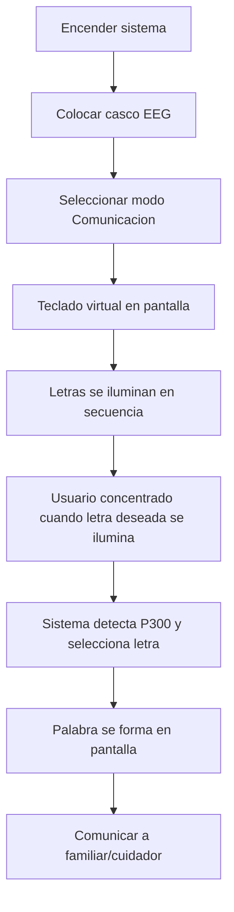
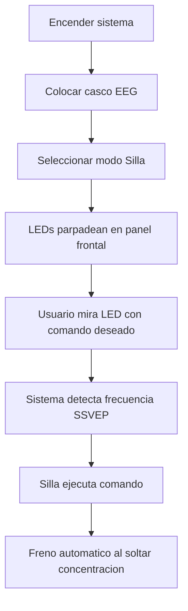

# Casos de Uso - ENA (Enlace Neural con Avatar)

Este documento describe las aplicaciones practicas del sistema ENA para diferentes perfiles de usuarios.

---

## 1. Caso de Uso: Comunicacion para Personas con ELA

### 1.1 Perfil de usuario
- Persona con Esclerosis Lateral Amiotrofica (ELA) en fase avanzada
- Dificultad para hablar o moverse
- Capacidad cognitiva conservada
- Necesidad de comunicarse con familiares y cuidadores

### 1.2 Configuracion recomendada
- **Hardware:** NeuroSky MindWave 2 + Raspberry Pi 4
- **Modo:** Comunicador P300
- **Interfaz:** Teclado virtual en pantalla
- **Tiempo de calibracion:** 20 minutos iniciales

### 1.3 Flujo de uso diario

### 1.4 Resultados esperados
- Velocidad inicial: 2-3 letras por minuto
- Velocidad con practica: 5-8 letras por minuto
- Frases simples en 5-10 minutos
- Satisfaccion del usuario: Alta (recupera capacidad de comunicacion)

### 1.5 Testimonio simulado
> "Antes de ENA, solo podia parpadear para decir si o no. Ahora puedo pedir lo que necesito, decir como me siento y hasta contar chistes. Mi familia me entiende de nuevo." 
> — Usuario con ELA, 3 meses usando ENA

---

## 2. Caso de Uso: Control de Silla de Ruedas

### 2.1 Perfil de usuario
- Persona con tetraplejia o movilidad reducida severa
- Usuario de silla de ruedas electrica
- Dificultad para usar joystick convencional
- Buena capacidad de concentracion

### 2.2 Configuracion recomendada
- **Hardware:** OpenBCI Cyton (8 canales) + Raspberry Pi 4
- **Modo:** SSVEP (potenciales evocados por frecuencia)
- **Interfaz:** 4 LEDs parpadeantes a diferentes frecuencias
- **Conexion:** Interfaz a silla de ruedas electrica

### 2.3 Frecuencias y comandos

| Frecuencia LED | Comando | Accion |
|:---|:---|:---|
| 12 Hz | Adelante | Silla avanza |
| 15 Hz | Atras | Silla retrocede |
| 20 Hz | Izquierda | Giro a izquierda |
| 30 Hz | Derecha | Giro a derecha |

### 2.4 Flujo de uso

### 2.5 Resultados esperados
- Tiempo de respuesta: 2-3 segundos
- Precision: 85-90% con practica
- Autonomia: 4-6 horas por carga
- Seguridad: Parada automatica por deteccion de relajacion

---

## 3. Caso de Uso: Rehabilitacion Post-ACV

### 3.1 Perfil de usuario
- Paciente post-ACV con hemiplejia
- En fase de rehabilitacion motora
- Puede seguir instrucciones simples
- Motivacion para recuperar movilidad

### 3.2 Configuracion recomendada
- **Hardware:** NeuroSky MindWave 2 + Raspberry Pi 4 + monitor
- **Modo:** Neurofeedback con imaginacion motora
- **Interfaz:** Juego serio con avatar

### 3.3 Protocolo de rehabilitacion

**Fase 1: Imaginacion pasiva (Semana 1-2)**
- 10 sesiones de 15 minutos
- Paciente imagina mover brazo afectado
- Avatar realiza el movimiento
- Feedback visual inmediato

**Fase 2: Imaginacion activa (Semana 3-6)**
- 15 sesiones de 20 minutos
- Paciente intenta activar musculos mientras imagina
- Avatar se mueve solo con senal cerebral clara
- Dificultad progresiva

**Fase 3: Transferencia a movimiento real (Semana 7-12)**
- 15 sesiones de 25 minutos
- Estimulacion electrica suave sincronizada
- Aparece movimiento real incipiente
- Refuerzo positivo con avatar

### 3.4 Resultados esperados

| Metricas | Sin ENA | Con ENA (12 semanas) |
|:---|:---|:---|
| Mejora en escala Fugl-Meyer | 10-15% | 35-45% |
| Activacion muscular voluntaria | 20% | 60% |
| Independencia en actividades diarias | Baja | Moderada |
| Motivacion del paciente | Media | Alta |

### 3.5 Testimonio simulado
> "Los terapeutas me decian que imaginara el movimiento, pero no sabia si lo hacia bien. Con ENA, veo al avatar moverse cuando mi cerebro lo intenta. En tres meses, puedo mover un poco la mano. Es un milagro."  
> — Paciente post-ACV, 60 años

---

## 4. Caso de Uso: Investigacion Academica

### 4.1 Perfil de usuario
- Investigador en neurociencia o BCI
- Estudiante de posgrado
- Necesita plataforma para experimentos
- Presupuesto limitado

### 4.2 Configuracion recomendada
- **Hardware:** OpenBCI Cyton + Raspberry Pi 4 + PC externo
- **Modo:** Desarrollo y adquisicion de datos
- **Software:** Python + BrainFlow + MNE

### 4.3 Aplicaciones en investigacion

| Area de estudio | Que permite ENA |
|:---|:---|
| Imaginacion motora | Clasificacion izquierda/derecha con datos abiertos |
| P300 | Potenciales evocados con estimulos visuales |
| SSVEP | Frecuencias multiples con LEDs |
| Neurofeedback | Entrenamiento con visualizacion en tiempo real |
| BCI pediatrico | Hardware no invasivo, seguro para ninos |

### 4.4 Datos para publicaciones

ENA proporciona:
- Acceso a datos crudos EEG (formato CSV)
- Marcadores de eventos sincronizados
- Codigo fuente abierto para reproducibilidad
- Protocolos experimentales documentados

---

## 5. Caso de Uso: Educacion y Divulgacion

### 5.1 Perfil de usuario
- Profesor de ciencias o tecnologia
- Taller de neurociencia para estudiantes
- Feria de ciencias escolar
- Museo interactivo

### 5.2 Configuracion recomendada
- **Hardware:** NeuroSky MindWave 2 + Raspberry Pi 4
- **Modo:** Demo simple de concentracion
- **Interfaz:** Juego donde avatar avanza con concentracion

### 5.3 Actividades posibles

- Demostracion de ondas cerebrales en tiempo real
- Competencia de concentracion entre estudiantes
- Explicacion de principios BCI
- Introduccion a procesamiento de senales

### 5.4 Impacto educativo
- Comprension de neurociencia basica
- Interes por carreras STEM
- Desmitificacion de tecnologia BCI
- Inclusion de estudiantes con discapacidad

---

## 6. Resumen de Configuraciones por Caso

| Caso de Uso | Hardware | Modo | Precio kit | Complejidad |
|:---|:---|:---|:---|:---|
| ELA comunicacion | NeuroSky | P300 | USD 299 | Baja |
| Silla de ruedas | OpenBCI | SSVEP | USD 599 | Media |
| Rehabilitacion ACV | NeuroSky | Neurofeedback | USD 299 | Media |
| Investigacion | OpenBCI | Multiple | USD 599 | Alta |
| Educacion | NeuroSky | Demo | USD 299 | Baja |

---

## 7. Requisitos de Espacio y Adaptaciones

### 7.1 Hogar
- Espacio tranquilo, sin ruido electrico
- Silla comoda con respaldo
- Buena iluminacion, sin reflejos en pantalla
- Mesa para Raspberry Pi y monitor

### 7.2 Centro de rehabilitacion
- Sala de terapia individual
- Camilla o silla ajustable
- Personal entrenado en BCI basico
- Protocolos de sesion estandarizados

### 7.3 Laboratorio de investigacion
- Jaula de Faraday (opcional)
- Amplificadores y filtros adicionales
- Sincronizacion con otros equipos (EMG, fMRI)
- Certificacion etica para experimentos humanos

---

## 8. Adaptaciones por Tipo de Discapacidad

### 8.1 Usuarios con espasticidad
- Cascos de sujecion suave
- Tiempos de calibracion mas largos
- Umbrales de deteccion ajustados

### 8.2 Usuarios con deterioro cognitivo
- Interfaz simplificada (2 opciones maximo)
- Sesiones cortas (10-15 minutos)
- Refuerzo positivo constante

### 8.3 Usuarios pediatricos
- Cascos de talla pequena
- Juegos adaptados a edad
- Supervicion adulta permanente
